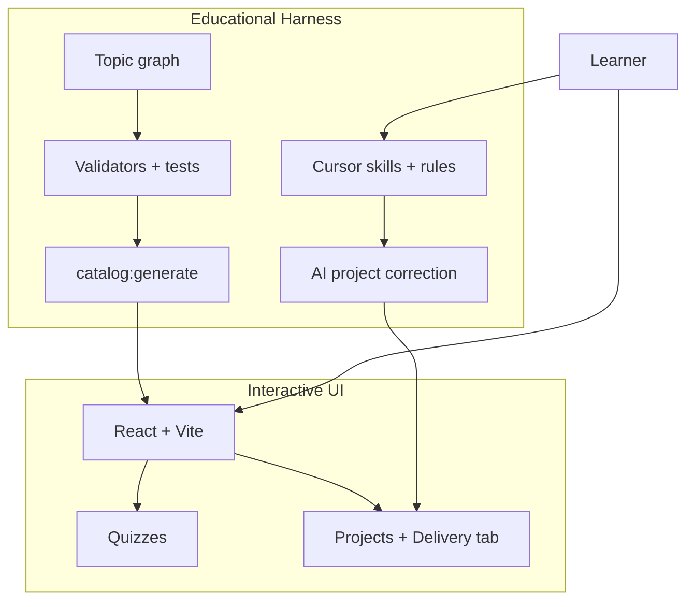

# Hackerrank Study

**Educational harness & interactive UI for self-directed coding mastery through Project-Based Learning.**

A local, repo-native EdTech system — not a hosted course platform. It pairs a **validated content pipeline** with a **React learning UI** and a **Cursor Agent harness** for tutoring, project correction, and curriculum authoring. Built for junior developers on a self-learning journey and as a portfolio piece demonstrating frontend engineering, UX, instructional design, automation, and AI orchestration as first-class concerns.

---

## At a glance

| Audience | What you find here |
|----------|-------------------|
| **Junior learners** | Graph-driven path, predict-first lessons, quizzes, CLI projects with AI correction, Socratic tutor, points & Pomodoro |
| **Recruiters & tech leaders** | Clean architecture, measurable progress artifacts, extensible harness, EdTech product thinking |
| **Content authors** | Graph-aligned scaffolding, validators, authoring skills — [Getting Started →](docs/GETTING_STARTED.md) |

Two complementary systems:

| Layer | Role | Key paths |
|-------|------|-----------|
| **Educational harness** | Validates curriculum, scaffolds PBL content, persists scores, powers AI workflows | [`graph/`](graph/), [`scripts/`](scripts/), [`tests/`](tests/), [`.cursor/`](.cursor/) |
| **Interactive UI** | Navigation, lessons, quizzes, project workspace, progress & focus tools | [`frontend/`](frontend/) |



**Content hierarchy:** `Course → Module → Lesson → (explanation, projects, quiz)` — see [`COURSE_STRUCTURE.md`](COURSE_STRUCTURE.md).

---

## How it's built

### Architecture

- **Content-on-disk** — curriculum as Markdown, JSON, and Node.js starters; no production backend or database
- **Static catalog** — `catalog:generate` syncs `course/` into JSON consumed by the UI
- **Dev-time persistence** — Vite plugins write quiz scores and project deliveries back to the filesystem
- **Frontend layers** — `domain → application → presentation → infrastructure`; URL-driven navigation; injectable repositories ([`ARCHITECTURE.md`](frontend/ARCHITECTURE.md))

### Harness layers

| Layer | Purpose |
|-------|---------|
| **Content** | [`graph/course.graph.txt`](graph/course.graph.txt) as source of truth; validators; `npm test` pipeline |
| **PBL** | Project README contracts; AI correction via `review-course-project` (>80 = pass) |
| **Cursor** | [Skills](.cursor/skills/) + [rules](.cursor/rules/) + Node scripts for tutor, reviewer, and author workflows |

### Tech stack

| Layer | Stack |
|-------|-------|
| UI | React 18, TypeScript, Vite, React Router 7, Zustand, Radix UI, Tailwind |
| Content | Markdown, JSON quizzes, Node.js CLI starters |
| Tooling | Node ESM scripts, `node --test`, Vitest |
| AI | Cursor Agent skills |

### Design & engineering focus

| Area | Highlights |
|------|------------|
| **Frontend** | Feature modules, clean architecture, substitutible data layer (static catalog today, API-ready) |
| **UX** | Hierarchy navigation, progressive disclosure via drawers, deep-linkable URLs ([`ARCHITECTURE-FRONT.md`](frontend/ARCHITECTURE-FRONT.md)) |
| **Design** | Token-driven glass UI, WCAG-conscious contrast, semantic quiz feedback, i18n-ready ([`DESIGN.md`](frontend/DESIGN.md)) |
| **Instructional design** | Prerequisite graph, predict-first lessons, spaced retrieval quizzes, rubric-based PBL (not answer-key matching) |
| **Automation** | Deterministic graph scaffolding, schema validation, integration tests for the authoring pipeline |

**Current scope:** JavaScript course (fundamentals → objects → async). The graph and harness extend to additional course roots.

---

## How learning works

### Session flow

1. **Read** a predict-first lesson in [`course/`](course/)
2. **Quiz** — interactive check with explanations on wrong answers
3. **Build** in `starter/index.js`, test with Node.js, save a delivery write-up in the **Delivery** tab
4. **Correct** — request AI review (`@review-course-project` or the Delivery tab **Project correction** button); iterate until score **> 80**

Use the **25-minute Pomodoro** in the app header to bound sessions (runs in the background while you navigate).

### Scoring & progress

| Activity | Points | Complete when |
|----------|--------|---------------|
| **Quiz** | 1 pt per correct answer (best attempt counts) | Retake anytime; UI tiers at ≥80% / ≥50% / <50% |
| **Project** | 4 pts when done | AI review score **> 80** / 100 |

**Course total** = quiz best scores + project points. Progress surfaces on the catalog, course overview, and module cards.

**Persistence:** browser state (Zustand) for instant UI; `course/<courseId>/quiz/score.json` for quiz/project status; `project-delivery.json` per project for delivery history and AI reviews.

### AI project correction

Projects are graded like a **mentor code review** — your `starter/` code and delivery write-up against the project README acceptance criteria, not a hidden reference solution.

The `review-course-project` skill collects lesson context, README criteria, starter code, and your **last 3 deliveries**, then saves a **0–100 score** and short actionable comment. Passing reviews mark the project **done** and sync to `score.json`.

| AI role | Skills | When to use |
|---------|--------|-------------|
| **Tutor** | `teacher-socratic`, `find-topics-graph` | Hints and concepts while coding — questions before answers |
| **Reviewer** | `review-course-project` | Rubric-based grade after you submit a delivery |
| **Author** | `create-course-module`, `generate-lesson-teacher`, `create-course-project`, `create-course-quiz` | Scaffold and validate new curriculum from the graph |

Tutor and reviewer are **separate by design**. Learner-facing skills require explicit invocation — the agent will not silently grade or tutor without you asking.

Skill details, example prompts, and commands: [Getting Started →](docs/GETTING_STARTED.md)

---

## Quick start

```bash
cd frontend && npm install
npm run catalog:generate   # sync course/ → static catalog
npm run dev                # open http://localhost:5173
```

From the repo root: `npm run dev` and `npm run catalog:generate` delegate to `frontend/`.

**Suggested rhythm:** one lesson per session; predict before running code; redo low-score quizzes; iterate projects until AI correction passes.

---

## Repository map

```text
hackerrank-study/
├── course/                 # Lessons, PBL projects, quizzes
│   └── javascript/         # Main course (fundamentals → async)
├── graph/                  # Topic taxonomy (source of truth)
├── frontend/               # Interactive UI (Vite + React)
├── scripts/ + tests/       # Harness: validation, graph sync, integration tests
└── .cursor/
    ├── skills/             # AI tutor, reviewer, and author playbooks
    └── rules/              # Agent guardrails (course hierarchy)
```

---

## Documentation

| Doc | Contents |
|-----|----------|
| [**Getting Started**](docs/GETTING_STARTED.md) | Setup, workflow, routes, Cursor skills, commands |
| [COURSE_STRUCTURE.md](COURSE_STRUCTURE.md) | Content hierarchy and metadata contract |
| [frontend/ARCHITECTURE-FRONT.md](frontend/ARCHITECTURE-FRONT.md) | Learner navigation journey |
| [frontend/ARCHITECTURE.md](frontend/ARCHITECTURE.md) | Routes, layers, score persistence |
| [frontend/DESIGN.md](frontend/DESIGN.md) | Design tokens, glass UI, quiz feedback |
| [docs/meta-schemas.md](docs/meta-schemas.md) | `*.meta.json` schemas |

---

## License & contribution

Private repository (`"private": true`). Extend content via [`graph/course.graph.txt`](graph/course.graph.txt) and authoring skills in [Getting Started](docs/GETTING_STARTED.md) — never invent topics outside their graph node.
