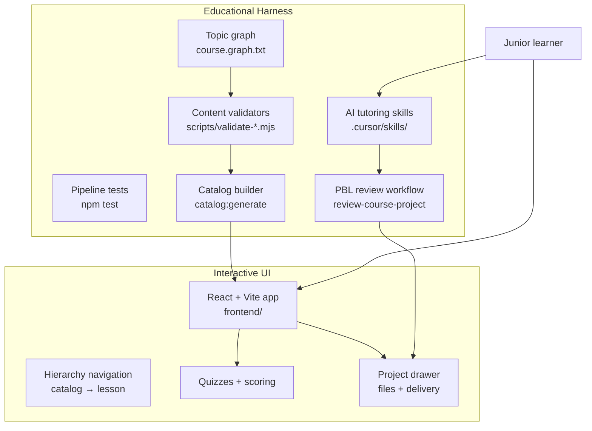

# Hackerrank Study

**Educational harness & interactive UI for self-directed coding mastery through Project-Based Learning.**

A local, repo-native learning system — not a hosted course platform. It combines a graph-driven curriculum, predict-first lessons, hands-on CLI projects, and AI-augmented tutoring via the Cursor Agent. Built for junior developers on a self-learning journey and for teams who care about structured, measurable practice.

---

## What this is

Two complementary systems work together:

| Layer | Role | Key paths |
|-------|------|-----------|
| **Educational harness** | Validates content, enforces taxonomy, scaffolds PBL projects, grades deliveries, powers AI tutoring | [`graph/`](graph/), [`scripts/`](scripts/), [`tests/`](tests/), [`.cursor/skills/`](.cursor/skills/) |
| **Interactive UI** | Learner-facing navigation, predict-first lessons, quizzes, project workspace, progress tracking | [`frontend/`](frontend/) |

> **Educational harness** — the validation, scaffolding, catalog, and AI-review pipeline that keeps curriculum structured and gives learners measurable feedback.
>
> **Interactive UI** — the learner-facing shell that reads from that pipeline.



**Canonical content hierarchy:** `Course → Module → Lesson → (explanation, projects, quiz)` — details in [`COURSE_STRUCTURE.md`](COURSE_STRUCTURE.md).

### The PBL learning loop

1. **Read** a predict-first lesson (Markdown in [`course/`](course/))
2. **Quiz** interactively — scores persist to `course/<course>/quiz/score.json`
3. **Build** in `starter/index.js`, test locally with Node.js, submit a delivery in the UI
4. **Review** via the `review-course-project` Cursor skill — score **> 80** marks the project complete

---

## For recruiters & tech leaders

### Problem this solves

Junior developers often practice by memorizing solutions. This project targets **reasoning under constraints**: predict output before running code, implement CLI-style challenges, and follow an explicit topic graph with prerequisites — closer to real interview and HackerRank-style work than passive video courses.

### Architecture snapshot

- **Content-on-disk** — no production backend or database; curriculum lives as Markdown, JSON, and Node.js starters in the repo
- **Static catalog** — `catalog:generate` syncs `course/` into a build-time JSON catalog consumed by the UI
- **Dev-time persistence** — Vite middleware plugins write quiz scores and project deliveries back to the filesystem during local development
- **Clean frontend layers** — `domain → application → presentation → infrastructure` (see [`frontend/ARCHITECTURE.md`](frontend/ARCHITECTURE.md))

### Three harness layers

| Harness | Purpose |
|---------|---------|
| **Content harness** | Graph as source of truth, validators, `npm test` pipeline — content cannot drift from taxonomy |
| **PBL harness** | Project README acceptance criteria + `review-course-project` scoring (>80 = pass) |
| **Tutoring harness** | Cursor skills as declarative tutor, reviewer, and author workflows — not ad-hoc prompts |

### Tech stack

| Layer | Stack |
|-------|-------|
| UI | React 18, TypeScript, Vite, React Router 7, Zustand, Radix UI, Tailwind |
| Content | Markdown, JSON quizzes, Node.js CLI starters |
| Tooling | Node ESM scripts, `node --test`, Vitest |
| AI | Cursor Agent skills in [`.cursor/skills/`](.cursor/skills/) |

**Current scope:** JavaScript course (fundamentals → objects → async). The graph and harness are designed to extend to additional course roots.

---

## For junior learners

### What you get

- A **guided path** through atomic topics, grouped into modules
- **Predict-first explanations** — reason about code before you run it
- **Interactive quizzes** with feedback on wrong answers
- **Hands-on CLI projects** that mirror coding-challenge format
- A **Socratic AI tutor** that guides with hints, not full solutions
- **Progress tracking** in the browser and on disk

### Suggested rhythm

- One lesson per short session, or half a module per long session
- Always **predict** output before executing examples
- Redo quizzes with low scores after re-reading the explanation
- Iterate on projects until review score **> 80**

### Quick start

```bash
cd frontend && npm install
npm run catalog:generate   # sync course/ → static catalog
npm run dev                # open http://localhost:5173
```

From the repo root you can also run `npm run dev` (delegates to `frontend/`).

**Full workflow, routes, and Cursor skills:** [Getting Started →](docs/GETTING_STARTED.md)

---

## Repository map

```text
hackerrank-study/
├── course/                 # Lessons, PBL projects, quizzes
│   └── javascript/         # Main course (fundamentals → async)
├── graph/                  # Topic taxonomy (source of truth)
├── frontend/               # Interactive UI (Vite + React)
├── scripts/ + tests/       # Harness: validation, graph sync, integration tests
└── .cursor/skills/         # AI tutoring & authoring workflows
```

---

## Documentation

| Doc | Audience | Contents |
|-----|----------|----------|
| [**Getting Started**](docs/GETTING_STARTED.md) | Learners & authors | Setup, lesson workflow, Cursor skills, commands |
| [COURSE_STRUCTURE.md](COURSE_STRUCTURE.md) | Authors | Content hierarchy contract and metadata schemas |
| [frontend/ARCHITECTURE-FRONT.md](frontend/ARCHITECTURE-FRONT.md) | Engineers & learners | Student navigation journey in the UI |
| [frontend/ARCHITECTURE.md](frontend/ARCHITECTURE.md) | Engineers | Routes, layers, and score persistence |
| [docs/meta-schemas.md](docs/meta-schemas.md) | Authors | `*.meta.json` schema reference |

---

## License & contribution

This is a private repository (`"private": true` in `package.json`). To extend content, follow the topic graph in [`graph/course.graph.txt`](graph/course.graph.txt) and use the authoring skills documented in [Getting Started](docs/GETTING_STARTED.md) — never invent topics outside their corresponding graph node.
