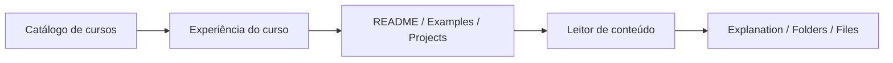
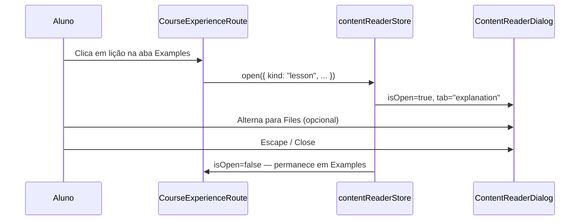
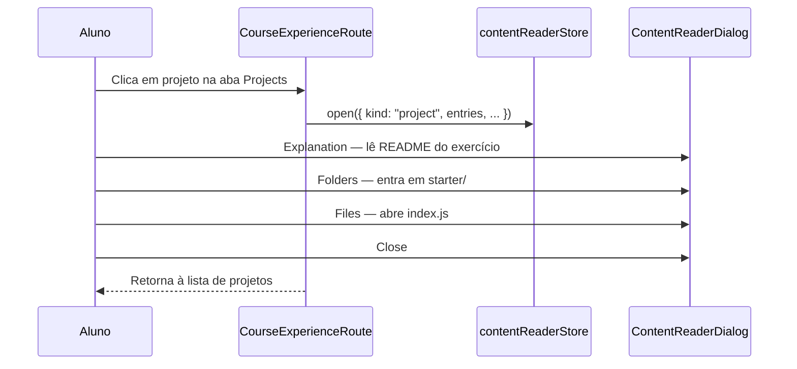
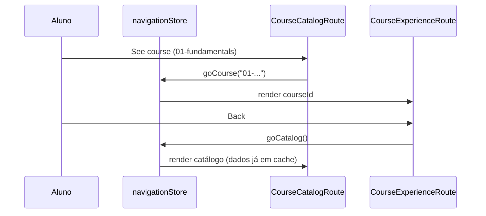

# Arquitetura Frontend — Navegação Fluida para Estudo

Este documento descreve a **arquitetura modular e flexível** do frontend do Hackerrank Study, com foco em oferecer uma **experiência de navegação contínua** para o aluno que percorre módulos, exemplos e projetos práticos.

Complementa [`ARCHITECTURE.md`](./ARCHITECTURE.md) (camadas técnicas) e [`DESIGN.md`](./DESIGN.md) (linguagem visual). Aqui o eixo central é **como o aluno se move pelo conteúdo** sem perder contexto.

---

## Objetivos

| Objetivo | O que significa na prática |
|----------|----------------------------|
| **Continuidade** | O aluno sempre sabe onde está (catálogo → curso → item) e como voltar. |
| **Progressive disclosure** | Visão geral primeiro; detalhes (README, arquivos, código) sob demanda. |
| **Zero fricção entre tipos de conteúdo** | Exemplos (lessons) e projetos (PBL) abrem no mesmo leitor, com abas consistentes. |
| **Modularidade** | Cada bloco (catálogo, experiência do curso, leitor) evolui de forma independente. |
| **Substituibilidade** | Dados estáticos hoje; API, progresso e busca amanhã — sem reescrever a UI. |

---

## Jornada do aluno

O conteúdo segue a estrutura descrita em [`COURSE_STRUCTURE.md`](../COURSE_STRUCTURE.md):

```text
course/
  01-javascript-fundamentals/
    README.md              ← visão do módulo
    examples/              ← lições teóricas (.md)
    projects/              ← exercícios PBL (pastas com starter/solution)
```

A interface espelha essa hierarquia em **quatro níveis de navegação**:



### Nível 1 — Catálogo (`catalog`)

- Lista todos os módulos disponíveis.
- Mostra contagem de exemplos e projetos por curso.
- Ação principal: **“See course”** → entra na experiência imersiva do módulo.

### Nível 2 — Experiência do curso (`course`)

- Três abas alinhadas ao contrato do repositório:
  - **README** — visão geral e checklist do módulo.
  - **Examples** — lista ordenada de lições em Markdown.
  - **Projects** — lista de exercícios PBL.
- Ação principal: clicar em um item → abre o **Leitor de conteúdo** (overlay).

### Nível 3 — Leitor de conteúdo (`ContentReaderDialog`)

- Componente global, acionado de qualquer curso.
- Três modos internos:
  - **Explanation** — README ou markdown da lição.
  - **Folders** — navegação em árvore (projetos com `starter/`, `solution/`, etc.).
  - **Files** — painel split: lista de arquivos + preview (markdown ou código).

### Nível 4 — Contexto dentro do leitor

- `cwd` (current working directory) para pastas aninhadas.
- Seleção de arquivo persistente na sessão do dialog.
- Fechar com `Escape` ou backdrop → retorna exatamente à aba do curso onde estava.

---

## Princípios de navegação fluida

### 1. Um leitor, dois tipos de item

Lessons e projects compartilham o mesmo contrato `ReaderItem`:

```typescript
type ReaderItem = {
  kind: "lesson" | "project";
  title: string;
  path: string;
  markdown: string;
  rootPath?: string;
  entries?: ReaderEntry[];
};
```

Isso evita duplicar UI e garante que o aluno **aprende um padrão de interação** uma vez e reutiliza em todo o curso.

### 2. Estado de rota separado do estado de leitura

| Store | Responsabilidade | Por quê |
|-------|------------------|---------|
| `navigationStore` | Rota de alto nível: `catalog` \| `course` | Troca de tela sem perder o catálogo carregado. |
| `contentReaderStore` | Overlay do leitor: item, aba, pasta, arquivo | Abrir/fechar conteúdo sem desmontar a rota do curso. |
| `courseCatalogStore` | Dados do catálogo + status de carga | Fonte única de verdade para todos os cursos. |

O leitor é **overlay**, não rota — o aluno fecha e continua na mesma aba (Examples/Projects) do curso.

### 3. Dados pré-carregados, navegação instantânea

O script `scripts/generate-static-catalog.mjs` gera `catalog.json` com markdown e arquivos embutidos. Na sessão de estudo:

- Carregar catálogo **uma vez** (`courseCatalogStore.load()`).
- Navegar entre cursos, lições e arquivos **sem round-trip de rede**.
- Transições limitadas a renderização React — sensação de app nativo.

### 4. Hierarquia sempre visível

Cada tela expõe **breadcrumb implícito**:

```text
Hackerrank Study › [Curso X] › Examples › 02. Equality And Coercion
                              └─ path no header do leitor
```

Regra: nunca mais de **dois cliques** para voltar ao nível anterior (Back, Escape, ou fechar dialog).

---

## Arquitetura modular

### Visão em camadas + módulos funcionais

```text
┌─────────────────────────────────────────────────────────────┐
│                    PRESENTATION                              │
│  AppShell │ CourseCatalogRoute │ CourseExperienceRoute       │
│  ContentReaderDialog │ MarkdownView │ Design System          │
├─────────────────────────────────────────────────────────────┤
│                    APPLICATION                               │
│  navigationStore │ courseCatalogStore │ contentReaderStore │
│  (futuro: progressStore, searchStore, preferencesStore)    │
├─────────────────────────────────────────────────────────────┤
│                    INFRASTRUCTURE                            │
│  staticCatalogRepository │ catalog.json (gerado)             │
│  (futuro: apiCatalogRepository, localStorageProgress)        │
├─────────────────────────────────────────────────────────────┤
│                    DOMAIN                                    │
│  types/catalog.ts — Course, Lesson, Project, Catalog       │
└─────────────────────────────────────────────────────────────┘
```

### Módulos funcionais (feature modules)

Cada módulo agrupa rota + stores + componentes relacionados. Novos módulos **plugam** via stores e contratos de domínio, não via imports cruzados na UI.

| Módulo | Pasta(s) | Entrada | Saída / efeitos |
|--------|----------|---------|-----------------|
| **Shell** | `presentation/core/layout/` | Props de tema e título | Layout consistente em todas as rotas |
| **Catalog** | `routes/CourseCatalogRoute`, `courseCatalogStore` | Montagem da rota | Lista de cursos; dispara `goCourse(id)` |
| **Course Experience** | `routes/CourseExperienceRoute` | `courseId` da rota | Abas README/Examples/Projects; dispara `openReader(item)` |
| **Content Reader** | `ContentReaderDialog`, `contentReaderStore` | `ReaderItem` | Leitura de markdown e arquivos; overlay global |
| **Navigation** | `navigationStore` | Actions `goCatalog`, `goCourse` | Estado de rota de alto nível |
| **Catalog Pipeline** | `scripts/generate-static-catalog.mjs` | Árvore `course/` | `infrastructure/static/catalog.json` |

### Estrutura de pastas (atual e recomendada)

```text
frontend/src/
  domain/
    types/
      catalog.ts              # contratos estáveis
  application/
    stores/
      navigationStore.ts
      courseCatalogStore.ts
      contentReaderStore.ts
    usecases/                 # (futuro) loadCatalog, openNextLesson, markComplete
    selectors/                # (futuro) getCourseById, getLessonSequence
  infrastructure/
    repositories/
      staticCatalogRepository.ts
    static/
      catalog.json            # gerado — não editar manualmente
  presentation/
    App.tsx                   # composição: rota + leitor global
    routes/
      CourseCatalogRoute.tsx
      CourseExperienceRoute.tsx
    components/
      ContentReaderDialog.tsx
      MarkdownView.tsx
    core/layout/
      AppShell.tsx
    design-system/            # tokens, Button, Card, Icon
```

---

## Fluxos de navegação (sequências)

### Abrir um exemplo



### Explorar um projeto PBL



### Percorrer vários cursos



---

## Contratos entre módulos

### Presentation → Application

- Componentes **só** importam stores e tipos de `application/` e `domain/`.
- Proibido: `presentation/` importar `infrastructure/` diretamente.
- Padrão: selector fino + action (`useNavigationStore(s => s.goCourse)`).

### Application → Infrastructure

- Stores recebem dados via repositório (hoje acoplado em `courseCatalogStore`; evolução: injeção no `create()`).
- Interface alvo:

```typescript
type CatalogRepository = {
  getCatalog(): Promise<Catalog>;
};
```

### Infrastructure → Domain

- Mapeamento DTO → tipos de domínio centralizado no repositório.
- `catalog.json` é artefato de build; regenerar com `npm run catalog:generate`.

### Domínio ↔ Repositório de conteúdo

O domínio reflete fielmente [`COURSE_STRUCTURE.md`](../COURSE_STRUCTURE.md):

| Entidade | Origem no repo | Uso na UI |
|----------|----------------|-----------|
| `Course` | `course/NN-nome/` | Card no catálogo; container da experiência |
| `Lesson` | `examples/*.md` | Lista na aba Examples |
| `Project` | `projects/.../NNN-nome/` | Lista na aba Projects; árvore no leitor |
| `ProjectEntry` | Arquivos sob o projeto | Abas Folders e Files |

---

## Extensibilidade (como evoluir sem quebrar)

### Adicionar nova rota de alto nível

1. Estender `Route` em `navigationStore.ts` (ex.: `{ name: "search" }`).
2. Criar `SearchRoute.tsx` em `presentation/routes/`.
3. Registrar no switch de `App.tsx`.
4. Opcional: store dedicado (`searchStore`) se a lógica for não trivial.

### Adicionar progresso do aluno

1. Novo store `progressStore` com `{ completedLessonIds, lastVisitedPath }`.
2. Repositório `localStorageProgressRepository` em infrastructure.
3. UI: checkmarks na lista de Examples/Projects; botão **“Próximo”** no leitor.
4. **Não** misturar progresso em `courseCatalogStore` — catálogo permanece read-only.

### Adicionar busca global

1. Índice derivado em application (`buildSearchIndex(courses)`).
2. Rota ou command palette (⌘K) na presentation.
3. Resultado da busca chama `goCourse` + `openReader` com o item correto — reutiliza módulos existentes.

### Migrar para URL routing (React Router)

Estado atual usa Zustand para rotas internas. Migração incremental:

| Estado Zustand | URL sugerida |
|----------------|--------------|
| `{ name: "catalog" }` | `/` |
| `{ name: "course", courseId }` | `/course/:courseId` |
| Leitor aberto | `/course/:courseId/:kind/:itemId` ou query `?open=...` |

O `contentReaderStore` pode sincronizar com search params sem reescrever `ContentReaderDialog`.

### Trocar fonte de dados

```text
StaticCatalogRepository  →  ApiCatalogRepository
         │                           │
         └─────── mesma interface CatalogRepository
```

Stores e rotas permanecem; apenas a implementação em infrastructure muda.

---

## Pipeline de conteúdo estático

```text
course/ (Markdown + código no repo)
        │
        ▼  npm run catalog:generate
scripts/generate-static-catalog.mjs
        │
        ▼
src/infrastructure/static/catalog.json
        │
        ▼  import no build (Vite)
staticCatalogRepository.getCatalog()
        │
        ▼
courseCatalogStore.courses
```

**Regra operacional:** após adicionar ou editar conteúdo em `course/`, regenerar o catálogo antes de `dev` ou `build`. Isso mantém a navegação fluida porque **tudo já está na memória** após o primeiro load.

Limites atuais do gerador (relevantes para UX):

- Arquivos de texto até ~200 KB embutidos; maiores aparecem como “binary/empty”.
- Extensões suportadas: `.md`, `.js`, `.ts`, `.json`, etc. (ver script).
- Pastas ignoradas: `node_modules`, `dist`, `.git`.

---

## Mapa mental: onde cada peça vive hoje

| Peça | Arquivo |
|------|---------|
| Composição raiz | `src/presentation/App.tsx` |
| Rota catálogo | `src/presentation/routes/CourseCatalogRoute.tsx` |
| Rota curso | `src/presentation/routes/CourseExperienceRoute.tsx` |
| Leitor overlay | `src/presentation/components/ContentReaderDialog.tsx` |
| Navegação | `src/application/stores/navigationStore.ts` |
| Catálogo | `src/application/stores/courseCatalogStore.ts` |
| Leitor (estado) | `src/application/stores/contentReaderStore.ts` |
| Tipos | `src/domain/types/catalog.ts` |
| Repositório | `src/infrastructure/repositories/staticCatalogRepository.ts` |
| Gerador | `scripts/generate-static-catalog.mjs` |

---

## Roadmap sugerido (navegação)

Prioridade orientada à **experiência do aluno**:

1. **URLs compartilháveis** — link direto para curso e item aberto.
2. **Próximo / Anterior** — sequência automática entre lições e projetos do módulo.
3. **Progresso local** — marcar item como lido; retomar de onde parou.
4. **Sidebar persistente** — árvore do curso visível enquanto lê (desktop).
5. **Busca** — encontrar conceito ou arquivo em todos os módulos.
6. **Atalhos de teclado** — `j/k` na lista, `?` para ajuda, `Esc` consistente.

Cada item é um **módulo incremental**: novo store ou selector + pequenas mudanças na presentation, sem alterar o contrato `Catalog`.

---

## Checklist de conformidade

Ao implementar novas features, validar:

- [ ] A UI importa apenas `application/` e `domain/`, nunca `infrastructure/` diretamente.
- [ ] Novo estado de navegação tem store dedicado ou estende um existente com responsabilidade clara.
- [ ] Lessons e projects continuam abrindo via `contentReaderStore.open()`.
- [ ] Fechar o leitor restaura o contexto do curso (aba Examples/Projects intacta).
- [ ] Tipos novos estendem `domain/types/` antes de aparecerem na UI.
- [ ] Conteúdo novo em `course/` passa por `catalog:generate` antes do deploy.

---

## Resumo

O frontend organiza o estudo em **módulos funcionais** (catálogo, experiência do curso, leitor) sobre **três camadas técnicas** (presentation, application, infrastructure). A navegação fluida vem de:

1. **Hierarquia espelhada** ao repositório `course/`.
2. **Leitor único** para exemplos e projetos.
3. **Estado separado** entre rota, catálogo e overlay de leitura.
4. **Catálogo estático pré-gerado** para transições instantâneas.
5. **Contratos estáveis** que permitem evoluir para URLs, progresso e API sem reescrever a experiência do aluno.

Para detalhes de implementação das camadas, ver [`ARCHITECTURE.md`](./ARCHITECTURE.md). Para tokens e componentes visuais, ver [`DESIGN.md`](./DESIGN.md).
